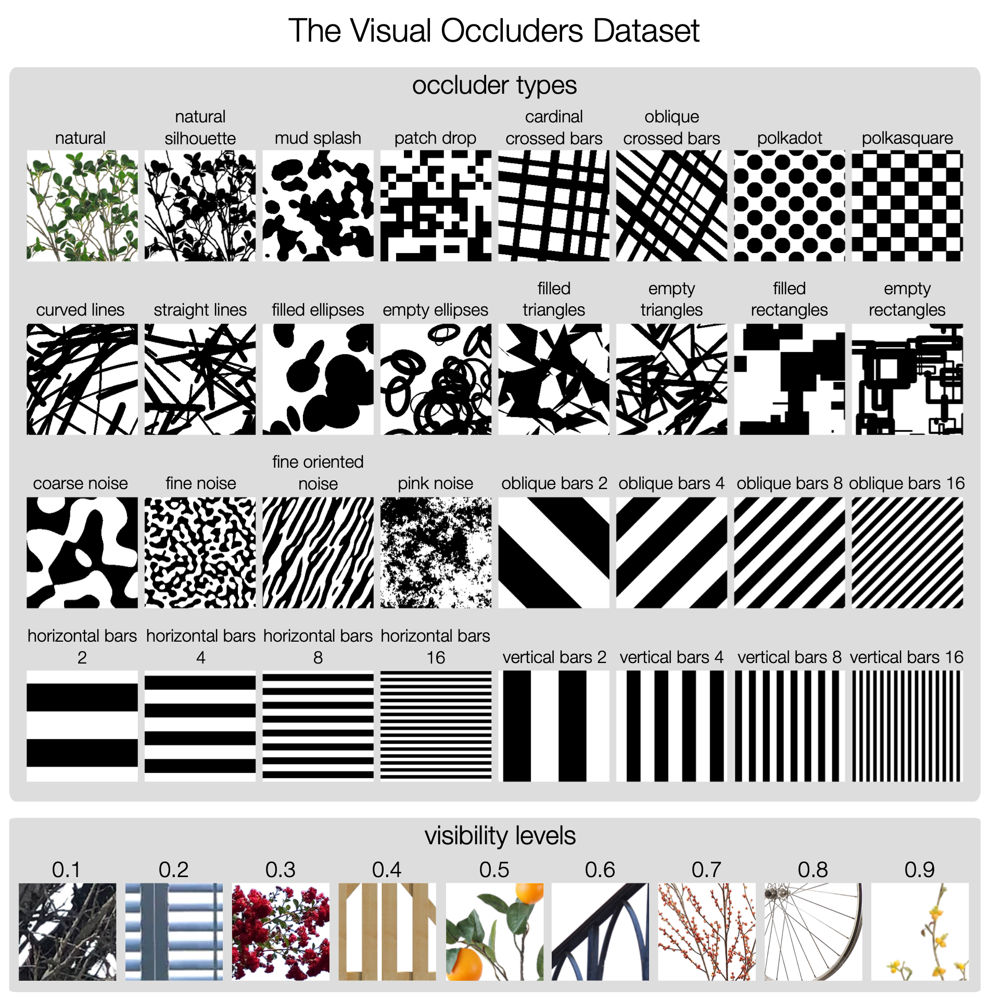

# The Visual Occluders Dataset

This repository contains useful code related to the Visual Occluders 
Dataset ([download](
https://drive.google.com/file/d/1BSQk5L94GNNqIOB7a-iKwjE_nDd8esHK/view?usp=share_link)).
See Occlude.py for code which applies the occluders to any image. This code 
can be used to either create an occluded version of a dataset, or to augment 
DNN training / evaluation inputs as they are loaded. The dataset contains up to 
1000 unique occluder masks for each occluder type and visibility level shown in the image below.

Each occluder type is stored in a separate directory, with subdirectories 
indicating the approximate visibility level of an underlying image once 
occluded (e.g. 10%, 20%, ..., 90%). Within each of these directories, the 
occluder masks are stored both as separate images and grouped into a PyTorch 
tensor (occluders.pt) for easy loading in deep learning applications. 
Natural occluders are stored in RGBA format, while all others are stored in 
L format for efficiency. These will appear inverted in the dataset itself, but 
will take their expected form once set as the alpha layer in an RGBA or LA 
image of your choosing. They can then be pasted onto any image using 
standard image processing libraries such as PIL or OpenCV.

The paper accompanying this dataset is in preparation, but for now please 
cite the following related work if you use this dataset in your research:

David Coggan, Frank Tong; Naturalistic dataset augmentation and self-supervised learning lead to more human-like recognition of occluded objects in convolutional neural networks. Journal of Vision 2024;24(10):1335. https://doi.org/10.1167/jov.24.10.1335.
